# CodeDumper + PTN - IDA Pro Plugin

A powerful IDA Pro plugin for dumping decompiled code, generating call graphs, and tracking dataflow provenance across function boundaries with advanced cross-reference analysis capabilities.

## Overview

CodeDumper is an advanced IDA Pro plugin that enables researchers to:
1. Extract decompiled code for functions with their complete call graphs (callers, callees, and references)
2. Generate DOT format graphs for visualization with Graphviz
3. **Track dataflow provenance** using PTN (Provenance Tracking Notation) to understand how data flows through parameters, locals, and globals across function calls

## Key Features

### Core Functionality
- **Comprehensive Code Dumping**: Extracts decompiled C code for selected functions and their related functions with embedded provenance annotations
- **Call Graph Generation**: Creates DOT format graphs for visualization with Graphviz
- **PTN Provenance Tracking**: Generates standalone provenance files tracking dataflow through parameters, locals, and globals
- **Bidirectional Analysis**: Traverses both upward (callers) and downward (callees/references) in the call graph
- **Configurable Depth**: Customizable traversal depth for both caller and callee analysis
- **Multi-Function Support**: Process single functions or multiple functions simultaneously

### Advanced Analysis Capabilities
- **Direct Call Detection**: Standard function calls via `call` instructions
- **Indirect Call Resolution**: Resolves targets through backward def-use analysis within basic blocks:
  - Uses IDA's FlowChart for basic block boundary detection
  - Traces register/memory definitions backwards within blocks
  - Handles simple MOV patterns for function pointer resolution
- **Virtual Call Detection**: Identifies and resolves C++ virtual function calls through VTable analysis
- **Jump Table Support**: Detects and follows switch statement jump tables:
  - Uses IDA's switch_info API when available
  - Falls back to manual pattern detection for `jmp [table + reg*scale]`
  - Follows up to 20 table entries (configurable limit)
- **Data Reference Tracking**: Finds functions referenced through data operations (e.g., `mov reg, offset func`)
- **Immediate Reference Detection**: Identifies function addresses used as immediate operands
- **Tail Call Recognition**: Detects the `push <addr>; ret` pattern for tail call optimization
- **Dynamic Import Awareness**: Basic support for GetProcAddress and similar dynamic loading patterns

### PTN Provenance Features
- **Intra-function Aliasing**: Tracks how locals and parameters are aliased (e.g., `ptr = &array[123]`)
- **Inter-function Dataflow**: Traces how arguments flow from caller origins into callee parameters
- **Chained Propagation**: Follows data through multiple function call levels
- **Global Read/Write Tracking**: Identifies which functions read/write to global variables
- **Embedded Annotations**: Code dumps include compact `@PTN` annotations near each function
- **Standalone PTN Files**: Export pure provenance data in structured PTN v0 format
- **Quick Identifier Lookup**: Copy PTN lines for identifiers under cursor in pseudocode view

### User Interface Integration
- **Context Menu Integration**: Right-click options in the Pseudocode view
  - Dump Function + Callers/Callees/Refs...
  - Generate DOT Graph + Callers/Callees/Refs...
  - Generate PTN + Callers/Callees/Refs...
  - Copy PTN for Identifier Under Cursor
- **Main Menu Integration**: Available under "Edit → Plugins → Code Dumper"
  - Dump Code for Multiple Functions...
  - Generate DOT Graph for Multiple Functions...
  - Generate PTN for Multiple Functions...
- **Progress Indication**: Real-time progress updates during analysis
- **Thread-Safe Operation**: Background processing with proper IDA API synchronization

## Requirements

- **IDA Pro 7.6+** (with Python 3 support)
- **Hex-Rays Decompiler** (required for code decompilation)
- **PyQt5** (for dialog boxes and UI elements)
- **Python 3.x**

## Installation

1. **Download the Plugin**
   ```bash
   git clone https://github.com/yourusername/ida-codedump.git
   ```

2. **Copy to IDA Plugins Directory**
   - Windows: `%IDADIR%\plugins\`
   - Linux/macOS: `$IDADIR/plugins/`
   
   Copy the entire `codedump` directory to your IDA plugins folder.

3. **Verify Installation**
   - Start IDA Pro
   - Check for "CodeDumper" in the console output
   - Verify menu items appear under "Edit → Plugins → Code Dumper"

## Usage

### Single Function Analysis

#### Via Context Menu (Pseudocode View)
1. Open a function in the Pseudocode view
2. Right-click to open the context menu
3. Select one of:
   - **"Dump Function + Callers/Callees/Refs..."** - For code extraction with embedded PTN annotations
   - **"Generate DOT Graph + Callers/Callees/Refs..."** - For graph visualization
   - **"Generate PTN + Callers/Callees/Refs..."** - For standalone provenance file
   - **"Copy PTN for Identifier Under Cursor"** - Copy provenance for highlighted variable

#### Configuration Dialog
You'll be prompted to specify:
- **Caller Depth**: How many levels up to traverse (0 = no callers)
- **Callee/Ref Depth**: How many levels down to traverse (0 = no callees)
- **Cross-Reference Types**: Which types of references to include:
  - `direct_call`: Standard function calls
  - `indirect_call`: Calls through registers/memory
  - `data_ref`: Data references to function addresses
  - `immediate_ref`: Immediate operands containing function addresses
  - `tail_call_push_ret`: Push/ret tail call pattern
  - `virtual_call`: C++ virtual function calls
  - `jump_table`: Switch statement targets
- **Maximum Characters**: Optional limit for output file size (0 = no limit)
- **Output File**: Where to save the results

### Multiple Function Analysis

1. Go to **"Edit → Plugins → Code Dumper"**
2. Select either:
   - **"Dump Code for Multiple Functions..."**
   - **"Generate DOT Graph for Multiple Functions..."**
   - **"Generate PTN for Multiple Functions..."**
3. Enter a comma-separated list of functions:
   - By name: `main, sub_401000, MyFunction`
   - By address: `0x401000, 0x402000`
   - Mixed: `main, 0x401000, sub_403000`
4. Configure the same options as single function analysis

### Output Formats

#### Code Dump (.c files with embedded PTN)
```c
// Decompiled code dump generated by CodeDumper

// --------
#PTN v0
// @PTN LEGEND
// Nodes: L(F,i)=local i in function F; P(F,i)=param i of F; G(addr)=global at addr; F(Fx)=function Fx.
// Slices: @[off:len] in bytes; '?' unknown; '&' = address-of; '*' = deref; optional cast as :(type).
// A: alias inside function   => A: dst := src[@slice][mode][:cast] {meta}
// I: inbound (caller→this)   => I: origin -> P(F,i) {caller=F?,cs=0x...,conf=...}
// E: outbound (this→callee)  => E: origin -> A(F?,arg) [-> A(F?,arg)...] {cs=0x...,conf=...}
// G: global touch/summary    => G: F(F?) -> G(0xADDR)   or   G: F(writer) -> G(0xADDR) -> F(reader)
// Dictionary entry (per function block): // @PTN D:F?=0xEA,Name
// --------

// Start Function: 0x401000 (main)
// Caller Depth: 2
// Callee/Ref Depth: 3
// Total Functions Found: 15
// Included Functions (15):
//   - main (0x401000)
//   - sub_401100 (0x401100)
//   - ...

// Incoming xrefs for main (0x401000): _start (0x400500) [direct_call]
// Outgoing xrefs for main (0x401000): printf (0x400600) [direct_call], sub_401100 (0x401100) [direct_call]
// @PTN D:F1=0x401000,main
// @PTN A:L(F1,0):=P(F1,0)& {conf=med}
// @PTN I:P(F0,0) -> P(F1,0) {caller=F0,cs=0x400500,conf=high}
// @PTN E:L(F1,0) -> A(F2,0) {cs=0x401050,conf=high}
// @PTN G:F(F1) -> G(0x404000)
// --- Function: main (0x401000) ---
int __cdecl main(int argc, char **argv)
{
    // ... decompiled code ...
}
// --- End Function: main (0x401000) ---
```

#### DOT Graph (.dot files)

```dot
# DOT graph generated by CodeDumper
# Start Function: 0x401000 (main)
# Caller Depth: 2
# Callee/Ref Depth: 3
# Total Nodes: 15
#
# --- Legend ---
# Solid Line: Direct Call
# Bold Line: Virtual Call
# Dashed Line: Indirect Call / Jump Table
# Bold Dashed Line: Tail Call (push/ret)
# Dotted Line: Data / Immediate Reference

digraph CallGraph {
    graph [splines=ortho];
    node [shape=box, style=filled, fillcolor=lightblue];
    edge [color=gray50];
    
    "0x401000" [label="main\n(0x401000)" fillcolor=red];
    "0x401100" [label="sub_401100\n(0x401100)"];
    
    "0x401000" -> "0x401100" [style=solid, tooltip="direct_call"];
}
```


**Note**: Long function names in graph nodes are automatically truncated to 40 characters for better visualization.

#### PTN Files (.ptn files)
```
#PTN v0
D:F1=0x401000,main;F2=0x401100,sub_401100;F3=0x400600,printf
D:F1=0x401000,main
A:L(F1,0):=P(F1,0)& {conf=med}
A:L(F1,1):=P(F1,1)& {conf=med}
I:P(F0,0) -> P(F1,0) {caller=F0,cs=0x400500,conf=high}
E:L(F1,0) -> A(F2,0) {cs=0x401050,conf=high}
E:L(F1,0) -> A(F2,0) -> A(F3,0)
G:F(F1) -> G(0x404000) -> F(F2)
D:F2=0x401100,sub_401100
...
```

**PTN Format Explanation:**
- `D:` - Dictionary mapping function IDs (F1, F2...) to addresses and names
- `A:` - Alias: tracks local/param aliasing within a function (e.g., pointer assignments)
- `I:` - Inbound: shows what caller origins feed into this function's parameters
- `E:` - Outbound: tracks how locals/params flow into callee arguments (with chaining)
- `G:` - Global: records which functions read/write globals, showing writer→reader relationships
- Nodes: `L(F,i)` = local, `P(F,i)` = param, `G(addr)` = global, `A(F,i)` = argument
- Slices: `@[off:len]` = byte offset and length into data structure
- Modes: `&` = address-of, `*` = dereference, empty = direct value

### Visualizing DOT Graphs

Use Graphviz to visualize the generated DOT files:

```bash
# Generate PNG image
dot -Tpng output.dot -o call_graph.png

# Generate SVG (scalable)
dot -Tsvg output.dot -o call_graph.svg

# Generate PDF
dot -Tpdf output.dot -o call_graph.pdf
```

## PTN Use Cases

The PTN (Provenance Tracking Notation) feature is particularly useful for:

1. **Vulnerability Analysis**: Track how tainted input flows through multiple function calls
2. **Reverse Engineering**: Understand complex data transformations across call chains
3. **Code Understanding**: Quickly see what data each function receives and passes on
4. **Buffer Analysis**: Identify array/buffer aliasing and offset calculations
5. **Global State Tracking**: Find all functions that read/write critical globals
6. **LLM Context**: Provide rich provenance metadata to language models for code analysis

### Quick PTN Workflow

1. Right-click on a function in pseudocode view
2. Select "Copy PTN for Identifier Under Cursor" while hovering over a variable
3. Paste into your notes/analysis tool to see that variable's provenance
4. For full analysis, use "Generate PTN + Callers/Callees/Refs..." with depth 2-3

## Advanced Features

### Cross-Reference Type Filtering
Control which types of references to follow during traversal:
- Use "all" to include all types (defaults to all 7 types: direct_call, indirect_call, data_ref, immediate_ref, tail_call_push_ret, virtual_call, jump_table)
- Specify individual types: `direct_call,data_ref,virtual_call`
- Exclude specific types for focused analysis
- Each edge in the graph maintains a set of all applicable reference types

### Size Limiting
When dealing with large codebases:
- Set a maximum character limit for output files
- The plugin will intelligently prune less important functions using an automatic algorithm:
  - Functions are sorted by output size (smallest first)
  - Removes functions starting with the smallest code size
  - Starting functions are always preserved regardless of size
  - Pruning continues until the output fits within the specified limit

### Virtual Function Analysis
For C++ binaries:
- Automatic VTable detection in read-only data segments:
  - Scans for sequences of ≥3 consecutive pointers to code functions
  - Validates pointers point to valid code segments
  - Properly handles both 32-bit and 64-bit architectures
- Virtual call resolution through pattern matching:
  - Detects `call [reg+offset]` patterns
  - Maps offsets to VTable entries
  - Resolves to specific virtual functions when possible
- Tracks inheritance hierarchies when possible

### Background Processing
- All analysis runs in background threads
- UI remains responsive during long operations
- Progress updates via wait boxes showing real-time function names during decompilation
- Proper synchronization with IDA's main thread
- Concurrency control prevents multiple simultaneous operations:
  - Single function dumps are tracked individually
  - Multi-function dumps block other operations
  - Prevents race conditions and ensures data consistency

## Troubleshooting

### Common Issues

1. **"PyQt5 not found" Error**
   - Install PyQt5 in IDA's Python environment
   - Verify IDA is using the correct Python installation

2. **"Hex-Rays decompiler is not available"**
   - Ensure you have a valid Hex-Rays license
   - Check that the decompiler is properly initialized

3. **No menu items appear**
   - Check IDA's console for initialization errors
   - Verify the plugin files are in the correct location
   - Ensure `ida-plugin.json` is present alongside `codedump.py`

4. **Decompilation failures**
   - Some functions may not be decompilable (e.g., data, imports)
   - Check for obfuscated or corrupted code
   - Verify function boundaries are correctly defined

### Performance Tips

- Start with smaller depth values (1-2) for initial exploration
- Use cross-reference type filtering to reduce graph complexity
- Set character limits for very large codebases
- Process multiple related functions together for efficiency

## Technical Details

### Architecture

The plugin consists of three main modules:

1. **codedump.py** - Main plugin with UI integration, call graph traversal, and orchestration
2. **micro_analyzer.py** - CTtree-based intraprocedural dataflow analysis for provenance extraction
3. **ptn_utils.py** - PTN format emission and dataflow chaining across function boundaries

### Threading Model
- Main IDA API calls use `execute_sync()` for thread safety
- File I/O operations run in background threads
- UI updates via `execute_ui_requests()`
- Concurrency control using thread locks and operation tracking
- CTtree analysis runs synchronously in IDA main thread for safety

### PTN Analysis Pipeline

1. **Decompilation**: Hex-Rays decompiles functions to ctree representation
2. **CTtree Traversal**: `micro_analyzer.py` visits call expressions and assignments
3. **Origin Normalization**: Tracks data through casts, refs, memptrs, array indexing, and arithmetic
4. **Summary Collection**: Builds `FunctionSummary` with ArgUse, Alias, and GlobalAccess records
5. **Cross-function Propagation**: `PTNEmitter` chains dataflow across call boundaries
6. **Output Generation**: Emits either embedded annotations or standalone .ptn files

### Memory Efficiency
- Visited sets prevent infinite recursion
- Incremental processing for large graphs
- Efficient edge storage using defaultdict with set values for multiple edge types
- Function decompilation results cached during processing
- PTN summaries computed once and reused for both code and PTN output

### Graph Traversal Algorithm
- Depth-first search for both caller and callee traversal
- Maintains separate visited sets for callers and callees
- Early termination when depth limit reached
- Handles circular dependencies gracefully

### Compatibility
- IDA 7.6+ (uses modern `ida_` module names)
- Compatible with IDA 9.x
- Python 3.x required
- Cross-platform (Windows, Linux, macOS)
- Adapts to platform-specific differences:
  - Segment names (e.g., ".text" on Linux/Windows, "__text" on macOS)
  - Automatically detects 32-bit vs 64-bit architectures

## Contributing

Contributions are welcome! Please feel free to submit issues or pull requests.

### Development Guidelines
- Maintain thread safety for all IDA API calls
- Add new cross-reference types to the allowed_types system
- Update both code dump and DOT generation for new features
- Include appropriate error handling and logging

## License

This project is licensed under the MIT License - see the LICENSE file for details.

## Acknowledgments

- IDA Pro and Hex-Rays teams for the excellent reverse engineering platform
- The IDA Pro plugin development community for examples and best practices

## Files

- **codedump.py** - Main plugin entry point with UI handlers and call graph logic
- **ptn_utils.py** - PTN dataflow emission and provenance chaining
- **micro_analyzer.py** - CTtree-based intraprocedural dataflow extraction
- **ida-plugin.json** - IDA plugin metadata descriptor

## Version History

- **2.0.0** - PTN Provenance Tracking Release
  - Added PTN (Provenance Tracking Notation) support
  - Embedded @PTN annotations in code dumps
  - Standalone .ptn file generation
  - CTtree-based dataflow analysis
  - Alias tracking and global read/write detection
  - Multi-level argument propagation chaining
  - Quick identifier provenance copy feature
- **1.0.0** - Initial release
  - Direct and indirect call analysis
  - Virtual function resolution
  - DOT graph generation
  - Multi-function support
